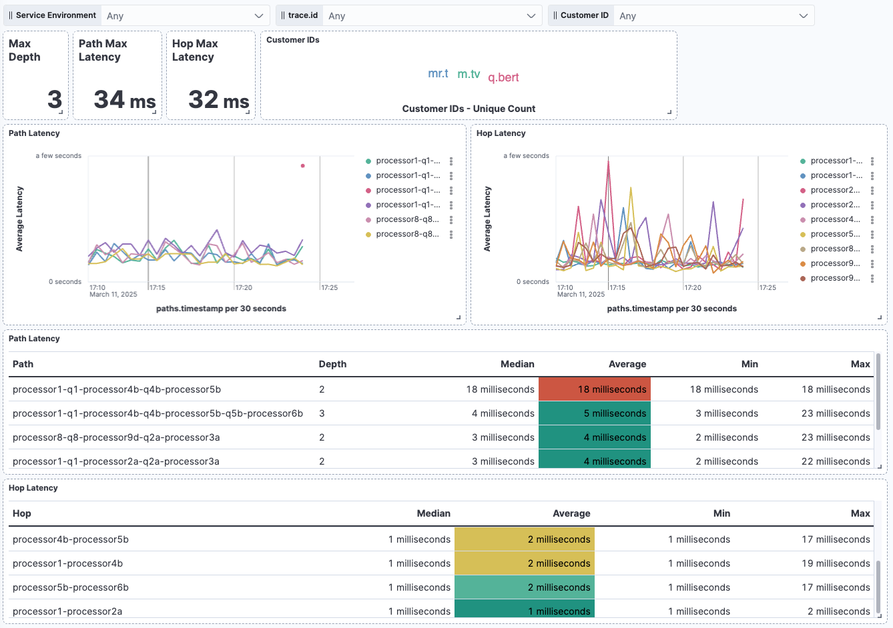
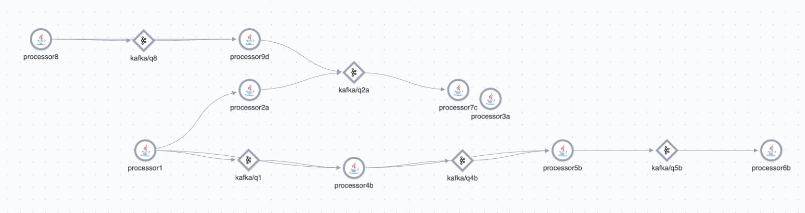

# Notes

[kafka-latency.json](es/transforms/kafka-latency.json) assumes ECS field names.

* If you are using Jaeger-based tracing, you will need to adjust the field names in [kafka-latency.json](es/transforms/kafka-latency.json) accordingly
* If you are using OTel-native-based tracing (EDOT Collector with Elasticsearch Exporter), you will need to adjust the field names in [kafka-latency.json](es/transforms/kafka-latency.json) accordingly

# Setup

## Environment Variables Setup

Create a `.env` with the following values:

ELASTICSEARCH_USER=
ELASTICSEARCH_PASSWORD=
ELASTICSEARCH_APIKEY=
ELASTIC_APM_SERVER_SECRET=
ELASTIC_APM_SERVER_ENDPOINT=

ELASTICSEARCH_URL=
KIBANA_URL=

`export $(cat .env | xargs)`

## Elastic Setup

Load transforms and Kibana resources:

```
cd es
./es.sh
```

## Build

`docker compose build`

# Run

`docker compose up`

# Scaling Notes

* we set a delay of "120s" to try to avoid instances where we have partial traces and later have to update the record
* ideally, you could head or tail sample traces before this transform to lower input volume
* see https://www.elastic.co/guide/en/elasticsearch/reference/current/transform-scale.html
  * e.g., increase number of shards used to write output
* If the transform is too costly to run realtime (and I would imagine it is at your scale), and you can deal with only looking at “windows” of data (e.g., sanity checking 4 1 hour windows a day), run it “manually” (scheduled by API) at periodic intervals (every 6h), each time processing just the last hour of data (I already do this in the query); maybe it takes 2 hours to run each time. While it might mean you have to wait a few hours to catch a looming problem, it at least it gives you visibility right now.
* you will need some kind of ILM to prevent the destination index from overflowing
